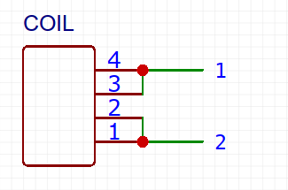
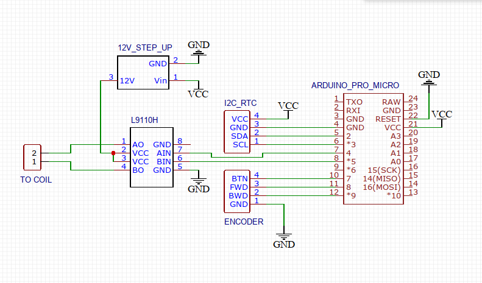
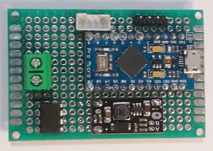

# inducta-clock

Docs, hardware and software for running `Type 5 BT600` based slave clocks.

## Content

* [Electrical Details](#electrical-details)
  * [Coil connection to 12V](#coil-connection-to-12v)
  * [Arduino circuit](#arduino-circuit)
* [Firmware](#firmware)
* [License](#license)


## Electrical details

### Coil connection to 12V

According to the [original documentation](./doc/BT630_637-operation-instructions.pdf) the coil can be run with DC if a shunt is connected. For 12V the shunt needs to be connected like this:



To switch minutes on the clock revert polarity for every step and pulse at least 160ms. The coil will draw around ~30mA @12V when flipping a blade.

|Step|Pin 1 polarity|Pin 2 polarity|
|:--:|:------------:|:------------:|
| 1  | +            | -            |
| 2  | -            | +            |
| 3  | +            | -            |
| 4  | -            | +            |
| .. | ..           | ..           |


### Arduino circuit

BOM:
* Arduino Pro Micro 5V Atmega32U4
* L9110H H bridge
* 5V to 12V step up module
* Encoder with button
* DS3131 RTC or DS1307 RTC module



The circuit can be connected to an Micro USB charger with at least 500mA over the Arduino USB port.

With some chinesium the board can be easily made:




## Firmware

[Platformio](https://platformio.org) is needed to compile and upload the firmware. Install the following libraries:

```
platformio lib install 275
platformio lib install 1371
```
(Normally this happens automatically when building)


Set `RTC_MODEL` in `src/config.h`. Use the following values:
```
1 = DS1307
2 = DS3231
3 = DS3232
```

Build the firmware like this:
```
make
```

Upload it like this:
```
make upload
```


## License

`inducta-clock` is licensed under [GPL v3](./LICENSE)
