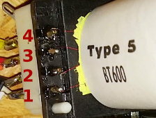
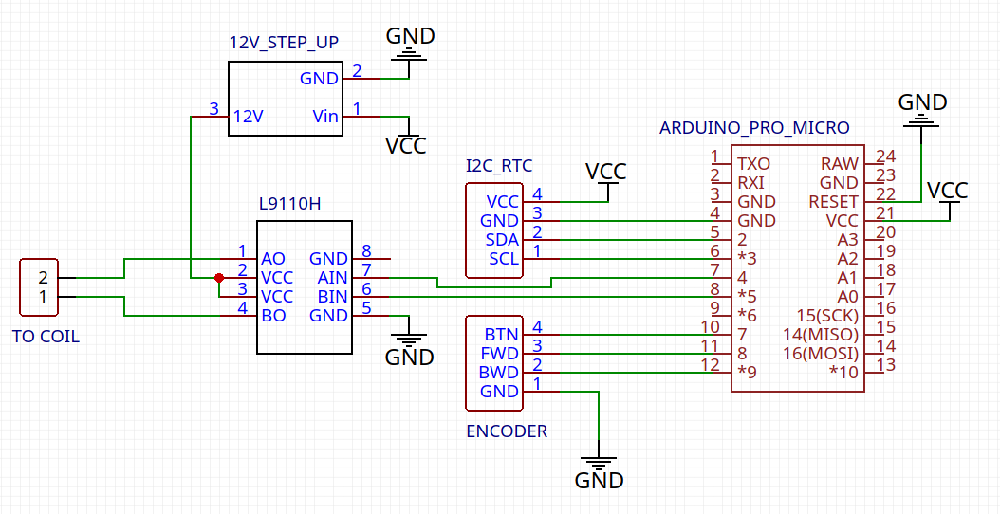

# inducta-clock

Docs, hardware and software for running `Type 5 BT600` based slave clocks.


## Electrical details


### Coil connection to 12V

In the [original documentation](./doc/bt659.pdf) it is mentioned that the coil can be run, if a shunt is connected. For the BT600 this would look like this:



To switch minutes on the clock revert polarity for every step and pulse at least 160ms.


### Arduino circuit

BOM:
* Arduino Pro Micro 5V Atmega32U4
* L9110H H bridge
* 5V to 12V step up module
* Encoder with button
* DS3131 RTC




## Firmware

[Platformio](https://platformio.org) is needed to compile and upload firmware. Install the following libraries:

```
platformio lib install 275
platformio lib install 145
```

Build the firmware like this:
```
make
```

Upload it like this:
```
make upload
```
